# PLC SQL Control

This application serves as an interface between an Omron PLC and an SQL Server, enabling real-time data monitoring and automated logging of process data into a database.

## 📥 Download
[Download](PLC_SQL_Control.rar)

---

## 🛠 Setup Requirements

### 1. PLC Configuration (Sysmac Studio)
To allow the application to communicate with your PLC, the following must be configured in Sysmac Studio:

* **Database Connection**: Set up the connection parameters to point to your SQL Server instance.
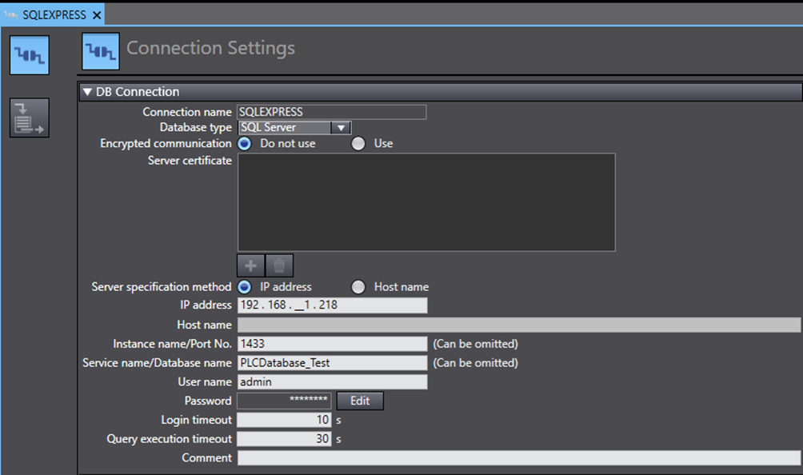
* **Global Variables**: Create these specific variables to allow the C# program to establish and verify connectivity:
    * `CSharp_Connected` (BOOL)
    * `DB_IPAddress` (STRING)
    * `DB_Name` (STRING)
    * `DB_Login_Name` (STRING)
    * `DB_Login_Password` (STRING)
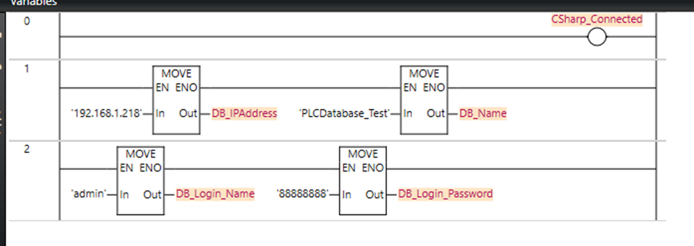
* **Publishing**: These variables must be set to **"Publish Only"** to be accessible by the external application.
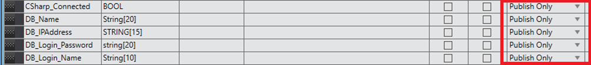
* **Logic Blocks**: Implement the following functional blocks for database operations:
    * **DB_Connect**: Validates the connection between the PLC and SQL Server.
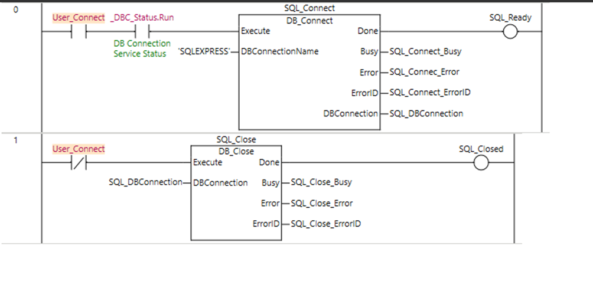
    * **DB_CreateMapping**: Maps the PLC data structure to the SQL table.
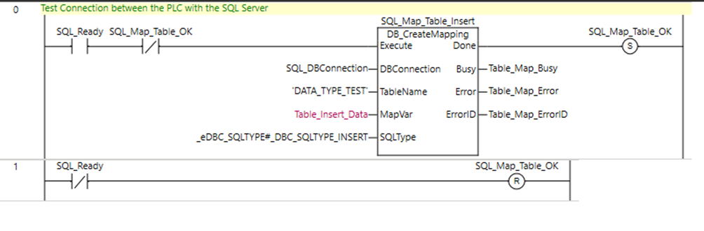
    * **DB_Insert**: Performs the actual data insertion.
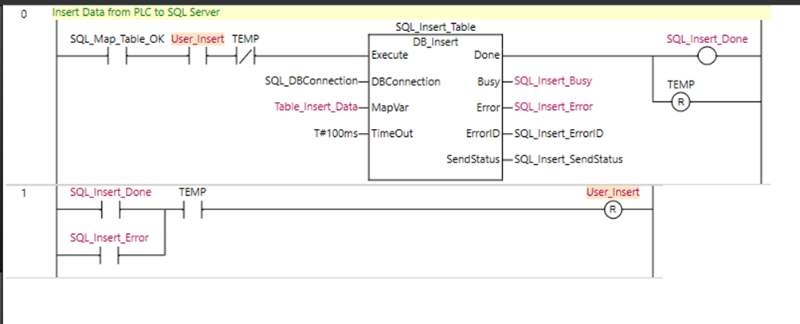

### 2. SQL Server Configuration
* **TCP/IP Protocol**: This must be enabled in the SQL Server Configuration Manager.
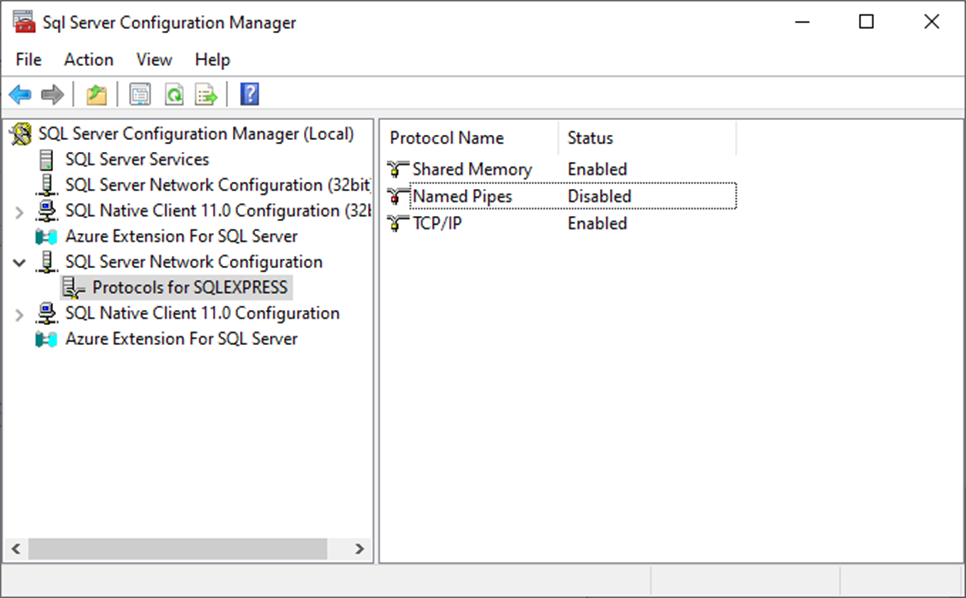
* **Port Settings**: Under the `IPAll` section of the TCP/IP properties, set the **TCP Port to 1433** and clear any Dynamic Ports.
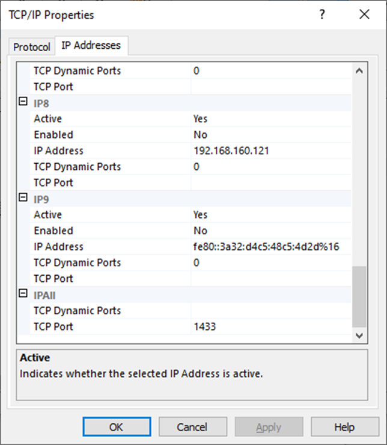
* **Create User** 

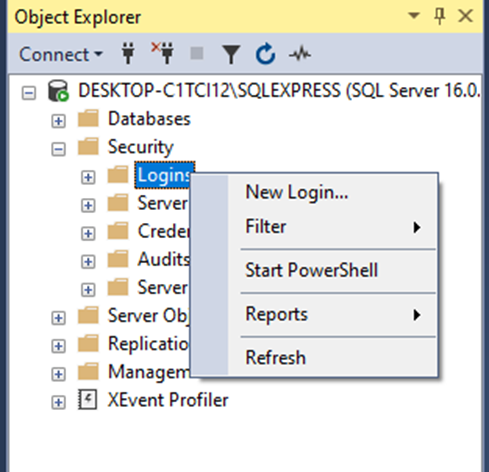

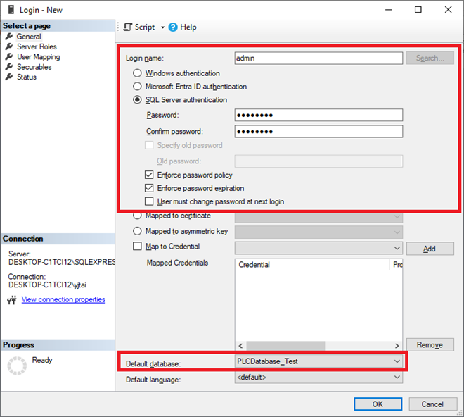

* **Permissions**: Use **SQL Server Authentication** and ensure the user has **`db_owner`** rights for the target database to permit data writes.
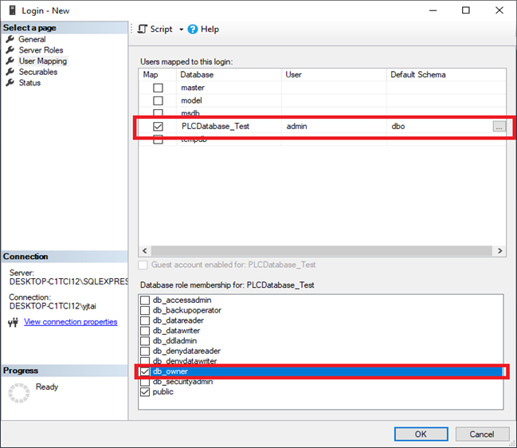
* **Firewall**: Add an **Inbound Rule** for **Port 1433** (TCP) in Windows Defender Firewall to allow external communication.
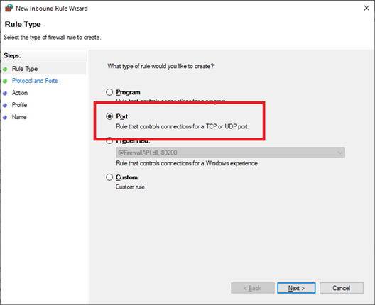

---

## 🗄 Database Structure

The target SQL table must align with the data members in your PLC data structure.

* **Mandatory ID**: A column named `ID` is required for the program to reference the table correctly.
* **Auto-Increment**: Set the `ID` column to `INT` with `IDENTITY (1,1)` to handle row indexing automatically.
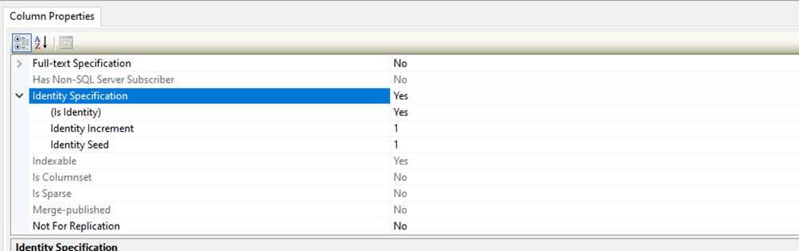


### Table Creation Script:
```sql
CREATE TABLE [dbo].[Data_Type_Test] (
    [ID] INT IDENTITY (1, 1) NOT NULL,
    [Boolean] BIT NULL,
    [S_INT] INT NULL,
    [U_INT] INT NULL,
    [REAL_NUM] REAL NULL,
    [TIMESTAMP] DATETIME NULL,
    [TEXT_STRING] NVARCHAR (MAX) NULL
);
```
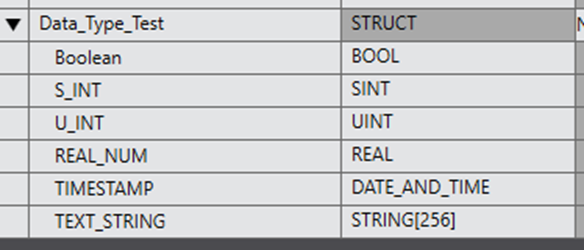
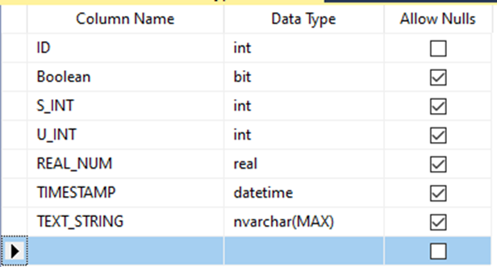


## 🚀 Features
* **Real-Time Viewer**: Monitor live PLC variable changes directly from the C# interface.
* **Automated SQL Logging**: Streamline the process of inserting operational data from the PLC directly into your SQL database.
* **CSV Data Export**: Includes a built-in tool to export logged database records into CSV files for offline analysis and reporting.
* **Connection Diagnostics**: Features visual status indicators to track the connectivity state of both the PLC and the SQL Server.